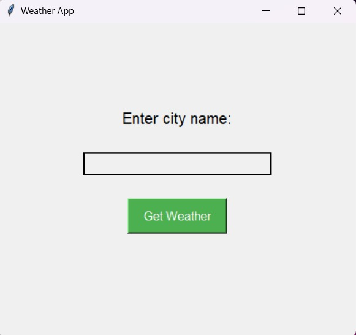
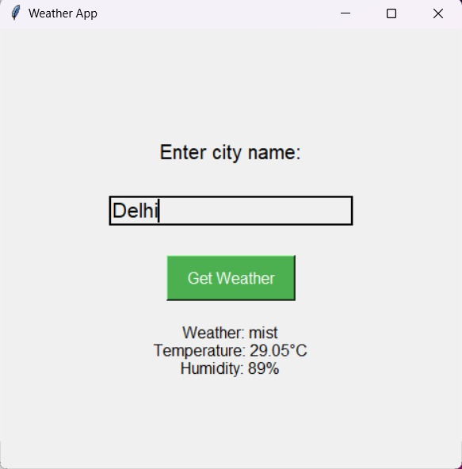

# Weather App using OpenWeatherMap API and Tkinter



This is a simple weather application that uses the OpenWeatherMap API to fetch weather data for a given city and displays it using a Tkinter GUI.

## Features

- Enter the name of a city to get its current weather details.
  
- Displays weather description, temperature, and humidity.
  
- Provides a user-friendly interface.

## Requirements

- Python 3
  
- Tkinter library
  
- `requests` library

## Setup

1. Clone this repository to your local machine.

```bash
https://github.com/Ananyasingh2002/PythonWeatherForecast.git
cd PythonWeatherForecast
```

2. Install the required libraries if you haven't already.

```bash
pip install requests
```

3. Replace API_KEY with your OpenWeatherMap API key in the Weather.py file.

4. Run the application.

```bash
python Weather.py
```

## Usage
- Launch the application.
  
- Enter the name of a city in the input field.
  
- Press the "Get Weather" button or press Enter to fetch and display weather information.

## Screenshots



## Contributing

Contributions are welcome! If you find a bug or want to add a new feature, feel free to create an issue or submit a pull request.
